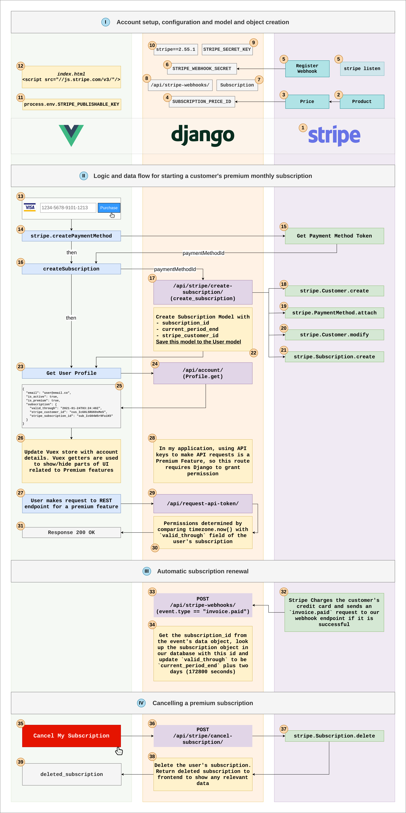

# Using Stripe for recurring monthly payments to a paid SaaS subscription in a Django + Vue.js application

This diagram shows the flow of data for the lifecycle of a paid customer subscription in a Django application with a Vue.js client. There are four stages:

I. Account setup, configuration, model and object creation
II. Logic and data flow for starting a customer's premium monthly subscription
III. Automatic subscription renewal
IV. Cancelling a premium subscription

## Context

This is my first attempt at using Stripe, or any other online payment service API. Most of what I have diagramed here comes from this article from the Stripe documentation: [https://stripe.com/docs/billing/subscriptions/fixed-price](https://stripe.com/docs/billing/subscriptions/fixed-price). Knowing almost nothing about what is needed to create a SaaS subscription, I found this article very helpful. It was a lot to read at once, but each call to to the Stripe API is very clear and straightforward.

I made some modifications and additions to this walkthrough for my use case, which is an API service called Open SEC Data, an open source project that I'm working on ([https://gitlab.com/briancaffey/sec-filings-app](https://gitlab.com/briancaffey/sec-filings-app)).

## Diagram

Here's a read-only link to the diagram: [https://drive.google.com/file/d/1oH2b0W-c-dI5oXzc_jvCGvXx9sJagr4a/view?usp=sharing](https://drive.google.com/file/d/1oH2b0W-c-dI5oXzc_jvCGvXx9sJagr4a/view?usp=sharing). This diagram is made with [https://www.diagrams.net/](https://www.diagrams.net/).

## Legend

Here's a detailed description of each part of the diagram, starting with the first section.

### I. Account setup, configuration, model and object creation

1) Setup a Stripe account. For local development, make sure you turn on `View test data`. On your local machine, install the stripe CLI and authenticate with your Stripe account

2) Create a Product in Stripe (mine is called `Open SEC Data Premium Subscription`)

3) Create a Price in Stripe that references the Product.

   Instead of creating these objects in the Stripe Dashboard, you can also create them with the Stripe CLI or the Python SDK. I created a Django management command called `create_stripe_data` that will create a Product and related Price in Stripe. We will need the id of the Price, it looks like this: `price_1Hx0goL67dRDwyuDh9yEWsBo`.

4) Add the Price ID as an environment variable `SUBSCRIPTION_PRICE_ID` to the backend. This will be used later when we make API calls to Stripe from inside of Django views.

5) For production environments, you will need to a register a Stripe webhook. This is an endpoint in Django that Stripe will POST to in order to inform the Django application of events that have happened in Stripe.

    For local development we need to run `stripe listen --forward-to localhost/api/stripe-webhooks/` in order to forward webhook events to the local Django application. This works really well for local development.

6) In both local and production environments we need to add an environment variables to the Django application that will be used to validate the webhook event.

7) You will need to create a `Subscrtiption` model or similar in your Django models. This model should be related to your user model in some way. At a minimum it should have the `subscription_id` (the ID of the Stripe Subscription) and `current_period_end` (also from the Stripe Subscription object). We will use this model in the next sections.

8) `/api/stripe-webhooks/` is the endpoint in the Django application that Stripe will send POST requests to in order to inform the Django application of events that happen in Stripe. The URL can be called anything you want, as long as you register it with that URL. In local development, you need to specify this URL in the `stipe listen` command (for example, `stripe listen forward-to localhost/api/stripe-webhooks/`).

9) `STRIPE_SECRET_KEY` is the name of the secret API key that should only be accessible by the backend. In local development, this key looks like `sk_test_Abc123`. In production, this key will look like `sk_Abc123`.

10) `stripe` is the name of the PyPI package that we need to add to `requirements.txt` (`requirements/base.txt`).

11) `STRIPE_PUBLISHABLE_KEY` is the value of the Stripe API key that can be made public and is used in the Vue application to instantiate Stripe.

12) The Stripe library is included in `index.html` via CDN so that it is accessible anywhere in the Vue application. Stripe object is instantiated in the Vue application with:

    > `let stripe = Stripe(process.env.STRIPE_PUBLISHABLE_KEY)`

### II. Logic and data flow for starting a customer's premium monthly subscription

With everything setup and configured properly in Stripe, the backend Django application and the frontend Vue application, customers can now start paying for monthly subscriptions. In my application, a user can sign up for an account first without having a premium subscription. In other scenarios, having an active account may require a premium subscription.

13) When a logged-in user visits their `/account` page, they will see the status of their account: Basic (free) or Premium (paid subscription). Users on a Basic plan will see the option to upgrade to Premium. They will be redirected to a `/premium` page where they will be presented with a credit card form. This credit card form is generated by [Stripe Elemenets](https://stripe.com/payments/elements). The user fills out their credit card, expiration date, card security code and billing ZIP code and then clicks `Purchase`.

14) Clicking on `Purchase` calls a method `purchase` that calls `stripe.CreatePaymentMethod`. The `paymentMethodId` token returned from `stripe.CreatePaymentMethod` is then passed to the method called `createSubscription`.

15) Stripe creates this object and returns a response that contains a `paymentMethodId` token.

16) `createSubscription` sends a POST request to `/api/stripe/create-subscription/` in the Django application with the `paymentMethodId` that we generated in the previous step.

17) `/api/stripe/create-subscription/` calls a view called `create_subscription` which makes a number of API calls to Stripe and then finally saves some data in the application's Postgres database.

18) The first API call creates the Customer object in Stripe if it does not exist. `email=request.user.email` is used in the API call to associate the Stripe customer with the user's email.

19) Next the payment method is attached to Stripe Customer model.

20) Next the Stripe payment method is set as the default payment method for Stripe customer for future billing.

21) The Stripe subscription model is created with the customer ID that was created in the earlier and the price ID corresponding to the premium subscription (added in the setup stage).

22) Once these Stripe API calls have finished, a new Subscription is saved in the Postgres database. `stripe_subscription_id`, `stripe_customer_id` and `valid_through` (DateTimeField that keeps track of the date through which the user's subscription has been paid for) are saved to the `Subscription` model and then the subscription model is saved to the user model's `subscription` field.

23) When the `createSubscription` method's POST requests returns successfully, the user's account is fetched again from `/api/account/`

24) The browser makes a request to `/api/account/`.

25) `/api/account/` returns information on the user and their subscription.

26) Data from `/api/account/` is updated in Vuex `user` store.

27) The user is now able to make requests to resources for premium features.

28) In this applicatoin, one such example is the ability to request an API key for making for making API calls.

29) A user makes a request to an API endpoint for a premium feature.

30) When determining permissions for resources that should only be accessible to customers with valid subscriptions, we need to compare `request.user.subscription.valid_through` to `timezone.now()` and make sure that `valid_through` is greater than `timezone.now()`.

31) Requests for protected resources are successfully returned to the browser.

### III. Automatic subscription renewal

The customer's credit card is charged once each montht that they are subscribed to the service. This action happens in Stripe. This section assumes that the customer's primary payment method is still valid (it has not been canceled experied or not able to be charged for some other reason).

32) The customer's card is charged in Stripe and an event is sent to the Django backend via a webhook that we registered in the setup stage.

33) The webhook view checks `event.type` and if the event is of type `invoice.paid` we extend the user's subscription by one month.

34) To extend the user's subscription, we modify the `DateTimeField` field on the `Subscription` that tracks the `current_period_end` which is included in the webhook data object. The model field in my code is called `valid_through`.

### IV. Cancelling a premium subscription

35) When a user decides to cancel their payed subscription service, they click on the `Cancel My Subscrtiption` button.

36) This makes a POST request to `/api/stripe/cancel-subscription` which calls the `cancel_subscription` view. This view calls `stripe.Subscription.delete(subscriptionId)`, where the `subscriptionId` is retreived from `request.user.subscription` (the `Subscription` model created in the setup section).

37) The subscription is deleted in Stripe through the `stripe.Subscription.delete` API call.

38) The user's subscription is deleted from the user model with `request.user.subscription.delete()`.

39) The frontend responds to the deleted subscription by fetching `/api/account/` again, refresh, or redirecting and the user no longer has access to their premium subscription.
